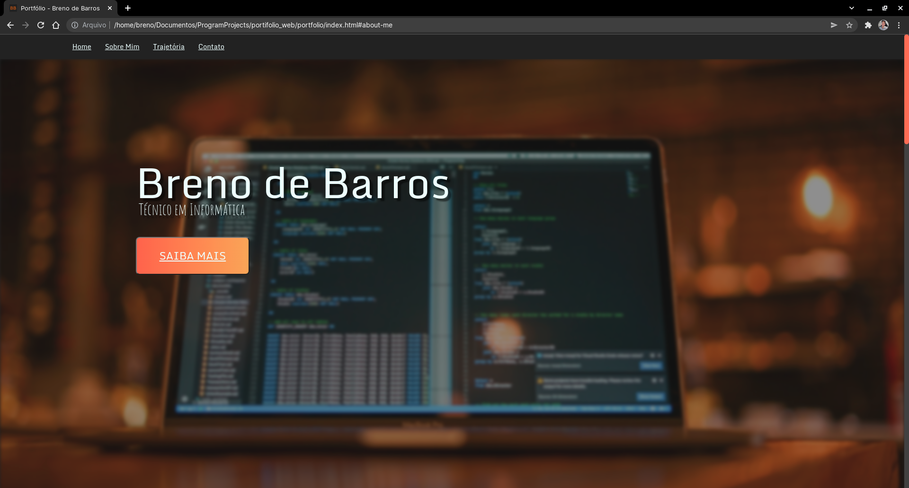
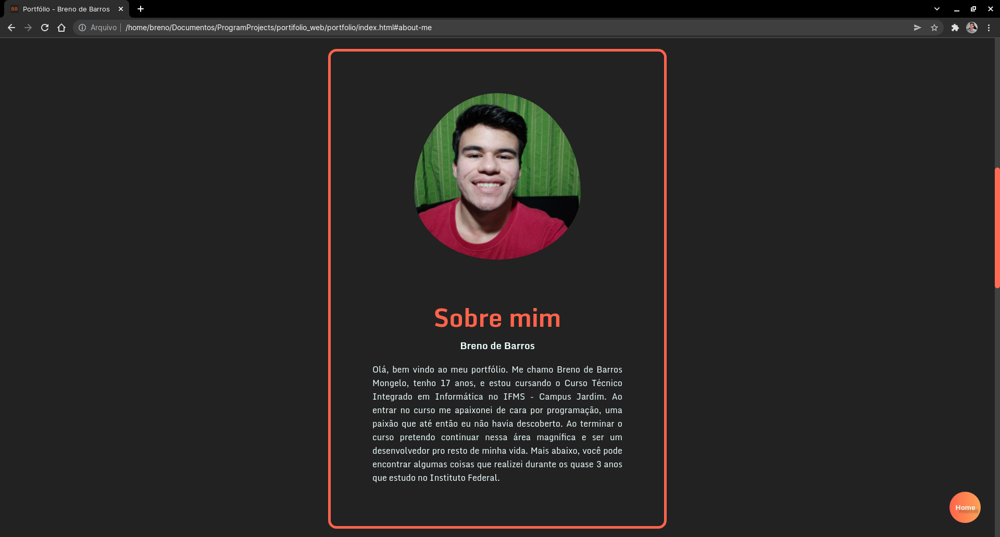
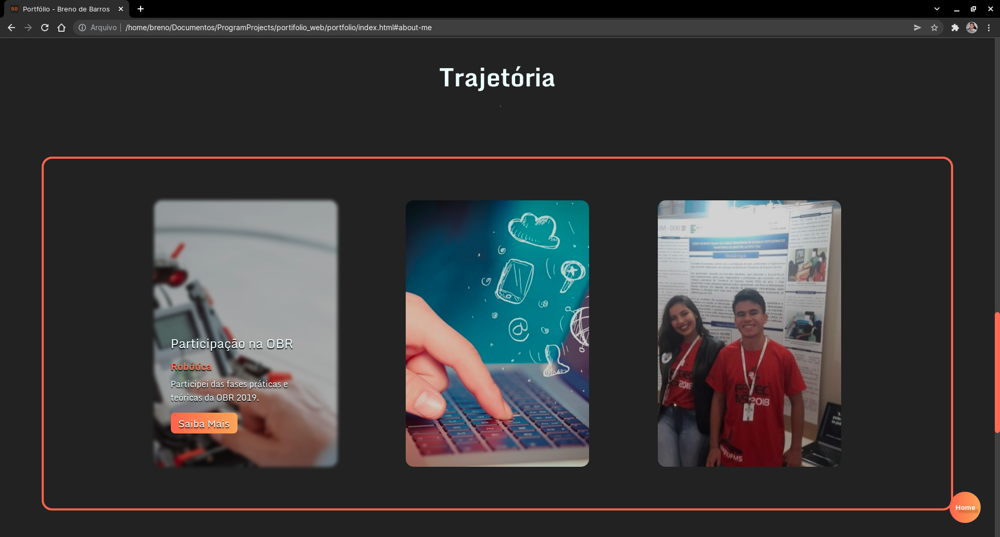
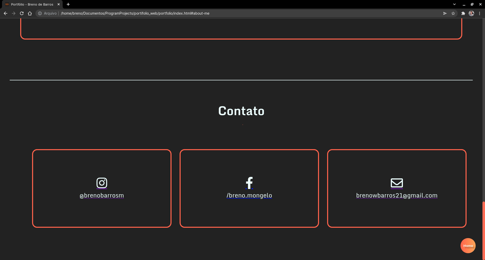

# **👤 Portifólio Web Pessoal**

 Este é um projeto criado para ser avaliado na disciplica de **Desenvolvimento Web 1** pelo IFMS Campus Jardim.

 

### **✨ Partes da página**

* #### **Home**

* #### **Sobre mim**

* #### **Trajetória**

* #### **Contato**

 

### **💻 Como visualizar no meu computador?**

Basta clonar o repositório e em seguida abrir o arquivo **index.html**.

 

### **🚀 Tecnologia utilizadas**
* HTML 5
* CSS 3
* JAVASCRIPT